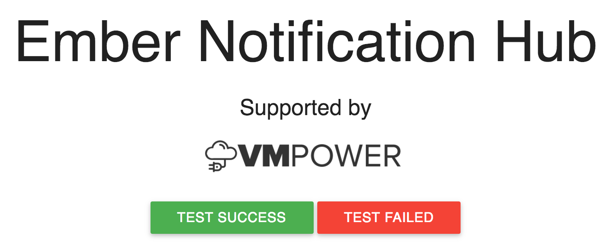

# ember-notification-hub

A small, flat design notifciation hub for your Ember app. Stick it to the top or bottom of your page. Show your users what asynchronous actions are pending, failed or completed.

Why? Most notification add-ons for ember do not take a promise interface, have a compact way to show many asychronous task results or persist them across sessions.

## Features

- View status of multiple, in-progress async actions
- Notification results stored to local storage for persistence across sessions
- Post notifications of synchronous actions
- Collapsed view shows # of tasks failed and succeeded and most recent task details
- Send async notifications as Promises
- JSON API friendly error handling
- Multiple error reason
- Sweet aninmations! 🍬
- Minimal dependencies - Installs Roberto Fonts
- Uses parts of [Materializecss](http://materializecss.com/) but doesn't muddle up your CSS
- Ember 2.0 Friendly

## Installation

### Install Package

```
ember install ember-notification-hub
```

### Place Component

Ember notification hub can either be mounted to the top or the bottom of your application. For the bottom of your app do:

```hbs
{{ember-notification-center bottom="-25px" openBottom="0px" left="20%" width="60%" pullDown=false}}
```

Where `bottom` is the CSS `bottom` position of the notification bar when it is collapsed, `openBottom` is the CSS `bottom` opsition when the hub is opened and `pullDown` indicates the orientation of the notificatio hub. The variable `left` and `width` sets their respective CSS properties for horizontal placement and width.

For mounting the hub to the top of your application use the `top` and `openTop` variables with `pullDown=true` do:

```hbs
{{ember-notification-center top="-25px" openTop="0px" left="20%" width="60%" pullDown=true}}
```

## Sending a Notification

To send a notification to the hub, the add-on installs the `emberNotificationCenter` service. Inject this to any Ember object you want to send the notificaiton from:

### Asynchronous Task Notifcations

Using the promise-based `pushNotification` API you can give immediate feedback to users by giving a short description of the asynchronous task and a promise that resolves when the task is complete:

#### Example: Arbitrary Notification

The add-on expects that if your async notification fails to reject the promise with an array of `error` objects. An error object contains a `code` and `title` field as show in `testFail`.

```js
export default Ember.Controller.extend({
    emberNotificationCenter: Ember.inject.service(),
    actions: {
        testFail: function () {
            this.get('emberNotificationCenter').pushNotification({
                title: 'Test Async Action 1',
                description: 'This shows an asynchronous notification with a promise'
            }, new Ember.RSVP.Promise((resolve, reject) => {
                setTimeout(() => {
                    reject([{
                        code: '404 Bad Request',
                        title: 'You must boogy before riding'
                    },
                    {
                        code: '403 Not Authorized',
                        title: 'Who do you think you are?'
                    }]);
                }, 3000);
            }));
        },
        testPass: function () {
            this.get('emberNotificationCenter').pushNotification({
                title: 'Test Async Action 1',
                description: 'This shows successful asynchronous notification with a promise'
            }, new Ember.RSVP.Promise((resolve, reject) => {
                setTimeout(() => {
                    resolve();
                }, 3000);
            }));
        }
    }
});
```

#### Example: Committing a DS.Model

Because the add-on is designed to handle Ember JSON API adapter errors, querying your backend through Ember Data Store will automatically render errors that occur from your server, without doing any extra work:

```js
this.get('emberNotificationCenter').pushNotification({
    title: 'Committing Model',
    description: 'Your model will be updated with the lastest info!'
}, myModel.save());
```

### Synchronous Task Notifications

These are notifications that do not render status of a notification based on a promise. The add-on assumes whatever action already successfully completed. You use the same `pushNotification` interface, but just omit the promise like so:

#### Example: A Simple Synchornous Notification


```js
this.get('emberNotificationCenter').pushNotification({
    title: 'You did it!',
    description: 'This thing that required no time was completed successfully.'
});
```

## Persistence

This addon uses [`ember-localstorage-adapter`](https://github.com/locks/ember-localstorage-adapter) to save notification results between application lifecycles. When a notificatin is still `Pending` it will not be saved. We assume that you will prevent users from leaving your application until a `Pending` notification is complete.

## Stuff Installed

### Dependencies

- Ember Local Storage Adapter
- Roberto Fonface

### Installed Ember Components

- 

Because of this persistence, two internally-used models are added upon installation:

- Service `emberNotificationCenter` - Used to push notifications from anywhere in your app
- Component `emberNotificationCenter` - The notification hub
- Component `emberNotificationPullOut` - Internally used by the notification hub to show individual notifications
- Model `emberNotificationLocalNotification` - Used to store notifications
- Model `emberNotificationLocalError` - Used to store notification failure reasons

## Running the Demo App

```
git clone https://github.com/vmpowerio/ember-notification-hub
cd ember-notification-hub
ember server
```

Visit your app at http://localhost:4200.

## Running Tests

* `npm test` (Runs `ember try:testall` to test your addon against multiple Ember versions)
* `ember test`
* `ember test --server`

## Building

* `ember build`

For more information on using ember-cli, visit [http://ember-cli.com/](http://ember-cli.com/).

# License

MIT
